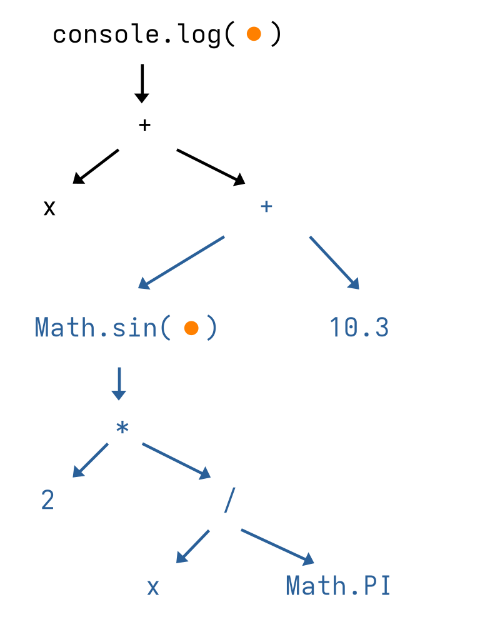
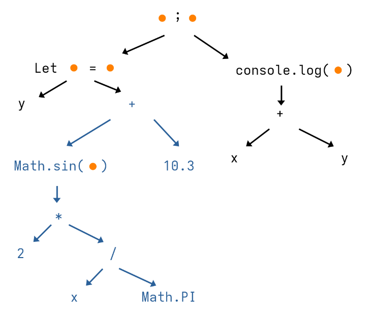
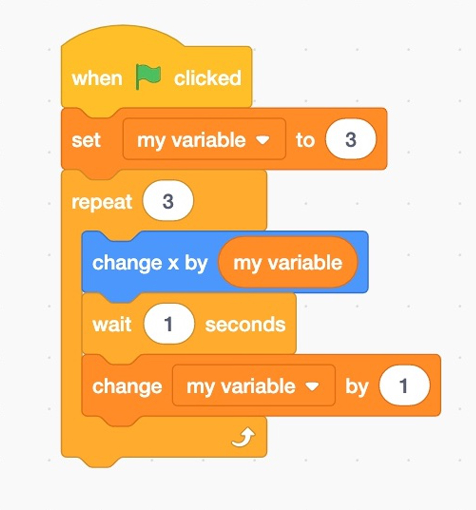
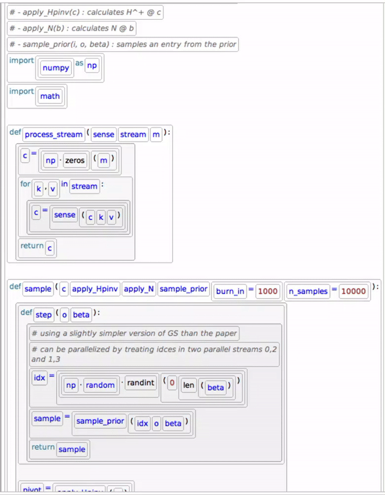
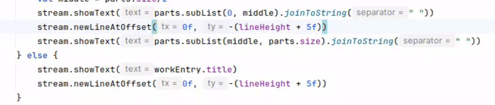

# W5 Structured Editors

Author: Julian Kalitzke

## What _is_ structured editing?

If you’ve ever written code, you’ve likely written it as one continuous wall of text. You can move the cursor to a position in the text, and when you type a letter, it will be inserted at that point. You can select a section and delete or copy it, and you can remove any single letter one by one. Once you have something that seems to make sense, you hand the text file to the compiler or interpreter and it will parse and process the code.

This has been true since the origins of programming. As early as the 1980s, when modern tools such as syntax-highlighting and code completion weren't a thing, researchers were thinking about whether pure text was really the best way of writing programs. After all, code is _not_ just text: it is inherently tied to a syntax, which the compiler or runtime understands. Thus, a text string representing syntactically correct code is actually representing a tree.

Consider the following piece of code.

```js
console.log(x + Math.sin(2*x/Math.PI) + 10.3);
```

In a simplified JavaScript syntax, this could be parsed into the following syntax tree:



Now suppose we would like to factor out that second addition inside the logged term. Surely, you know how to modify the above code snippet into this one:

```js
let y = Math.sin(2*x/Math.PI) + 10.3;
console.log(x + y); 
```

My fictional syntax tree for this code looks like this:



However, notice that the blue part is actually the same (sub-)tree! So we could have _directly_ edited the tree by adding some nodes and moving the whole subtree to another place! This is what structured editing, sometimes called projectional editing, aims to offer.

## Block-based programming

The first advances in structured editing started in the 1980s [1]. Researchers wanted to abstract away annoying syntactical details for the programmer and improve error diagnosis (there were no fancy IDEs back then!). The benefit of structure editors, the researchers argued, was that you inherently cannot make syntactical mistakes - the tree is always valid.

The first structured editors were menu-based, where users had to select from a list of code constructs to be inserted into the code. The perhaps most well-known menu-based editor today and possibly the most famous structured-editor overall is Scratch [2]. It looks like this:



The syntax tree nodes are split into text fields (for literals) and Lego-like pieces (for constructs) that can be dragged and dropped around and snap together, guiding the user interactively.

Scratch was developed in 2009 and is a structured editor targeted for education, but this idea actually goes as far back as 1995 [3]. Since Scratch, Google has developed their own block-based editor called Blockly [4], cementing structured editors as the first point of contact with coding for many children.

## Text-based structured editing

If you have ever worked with Scratch you will have realized that this is quite cumbersome for real-world programming. Research thus quickly turned to designing a _textual_ tree editor. This introduces many challenges: Where do you place the cursor? Where does it go if you press arrow keys? Where are new characters placed? How is text turned into tree nodes?

Most editors represent the tree with visual cues around the linearized text representation. This means that the code more or less is aligned like in a traditional text editor. Holes in the tree (incomplete syntax) are highlighted and sometimes the tree structure is visualized explicitly.

Hazel [5] is an editor that allows programming in a specifically designed functional programming language and, notably, can also _execute_ partial syntax trees. This was achieved by defining a complex type-system and -theory based on lambda calculus.

But most of the time, programmers already have a programming language they want to program in. In this case, the structured editor must be designed in a way to handle arbitrary syntaxes. These are often called structured editor generators. One very recent example is Sandblocks [6]. Syntax is provided using Tree-sitter, an open-source parser generator. The generated parser is augmented by _partial parsing_ which also outputs possible ways to complete the tree (fill holes).

Just like regular code editors, Sandblocks allows opening, editing and saving text files. However, when editing, the editor supports both textual input, as well as moving (and deleting) whole tree nodes. Pretty cool!



The editor features a "block cursor" which, like the text cursor, can be moved with arrow keys and can copy, cut and paste whole blocks (nodes).

When inserting text, the partial parser informs the editor which structures are permitted, and then shows a popup to the user and creates a new node once it is clear which syntax construct is inserted.


Sandblocks is still being developed and a user-study suggests some design decisions (e.g. cursor heuristics) that could be revisited. Nevertheless, it allows a glimpse into how practical text-based structured editors could one day look like.

## Structured editing in disguise

Although structured editing hasn't made it out of research except in education and some small niches (like JetBrains' MPS editor [7]), ideas from structured editing have actually sneaked into text-based code editors over time.

One example any programmer surely knows are small buttons next to the text field that allow collapsing and expanding a block of code, such as a while- or an if-block.

Another example is the feature present in many IDEs such as JetBrains' IntelliJ IDEA of refactoring out a term into a new variable as shown below. The user selects a code expression (effectively a syntax tree node), presses a shortcut and the editor cuts the code and places it in a new variable assignment template above the current one line. The cursor is moved to the variable name. The user enters characters that are synchronously inserted as the new variable's name and in the original place of the expression.



This shows how being aware of syntax supercharges a code editor or IDE and makes the programming experience much more efficient.

## The future

Structured editing has yet to make its way into mainstream programming. While it has already strongly influenced plain-text coding editors, programmers could certainly benefit from even more structure-aware coding environments. One could imagine an integrated approach, with a toggle between "text-mode" and "tree-mode", similar to editors like `vim`.

At the same time, there is growing interest in rethinking the necessity of programming entirely, letting language models do the coding. These tools are generally still used by human programmers who alternate between reviewing code and prompting edit changes.

However, it is often tedious to describe in text which part should be edited. Here, structured editing could significantly improve the programmer's efficiency. Structured selection ([6], [8]) would let the programmer define the context of the next prompt at a keystroke, while a visual interface outlining the syntax tree makes it easier to understand the changes to the code at a glance.

With the rise of language models, structured editing may become a more natural fit for modern coding workflows, offering benefits that plain-text editing can't match.

## About Me

I am a Master's student in Computer Science at ETH Zurich focused on Algorithm Design and Theoretical Computer Science. During my Bachelor's degree at TU Munich, I worked on language design, creating a domain-specific language for programming FPGAs.

## References

\[1] Teitelbaum, T., & Reps, T. (1981). _The Cornell program synthesizer: A syntax-directed programming environment_. _Communications of the ACM, 24_(9), 563–573. https://doi.org/10.1145/358746.358755

\[2] Resnick, M., Maloney, J., Monroy-Hernández, A., Rusk, N., Eastmond, E., Brennan, K., Millner, A., Rosenbaum, E., Silver, J., Silverman, B., & Kafai, Y. (2009). _Scratch: Programming for all._ _Communications of the ACM, 52_(11), 60–67. https://doi.org/10.1145/1592761.1592779

\[3] Repenning, A., Webb, D. C., Koh, K. H., Nickerson, H., Miller, S. B., Brand, C., Her Many Horses, I., Basawapatna, A., Gluck, F., Grover, R., Gutierrez, K., & Repenning, N. (2015). _Scalable game design: A strategy to bring systemic computer science education to schools through game design and simulation creation_. _ACM Transactions on Computing Education, 15_(2), Article 11, 1–31. https://doi.org/10.1145/2700517

\[4] https://developers.google.com/blockly

\[5] Omar, C., Voysey, I., Hilton, M., Aldrich, J., & Hammer, M. A. (2017). _Hazelnut: A bidirectionally typed structure editor calculus_. In _Proceedings of the 44th ACM SIGPLAN Symposium on Principles of Programming Languages (POPL ’17)_ (pp. 86–99). Association for Computing Machinery. https://doi.org/10.1145/3009837.3009900

\[6] Beckmann, T., Rein, P., Ramson, S., Bergsiek, J., & Hirschfeld, R. (2023). _Structured editing for all: Deriving usable structured editors from grammars_. In _Proceedings of the 2023 CHI Conference on Human Factors in Computing Systems (CHI ’23)_ (Article 595, pp. 1–16). Association for Computing Machinery. https://doi.org/10.1145/3544548.3580785

\[7] Voelter, M. (2010). _Implementing feature variability for models and code with projectional language workbenches_. In _Proceedings of the 2nd International Workshop on Feature-Oriented Software Development (FOSD ’10)_ (pp. 41–48). Association for Computing Machinery. https://doi.org/10.1145/1868688.1868695

\[8] Hempel, B., Lubin, J., Lu, G., & Chugh, R. (2018). _Deuce: a lightweight user interface for structured editing_. In _Proceedings of the 40th International Conference on Software Engineering (ICSE '18)_ (pp. 654–664). Association for Computing Machinery. https://doi.org/10.1145/3180155.3180165
