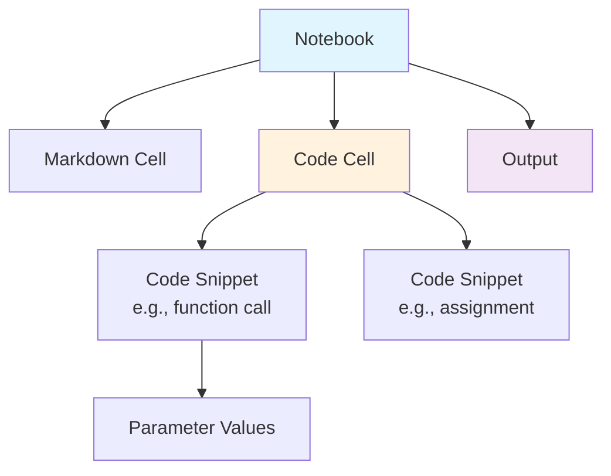
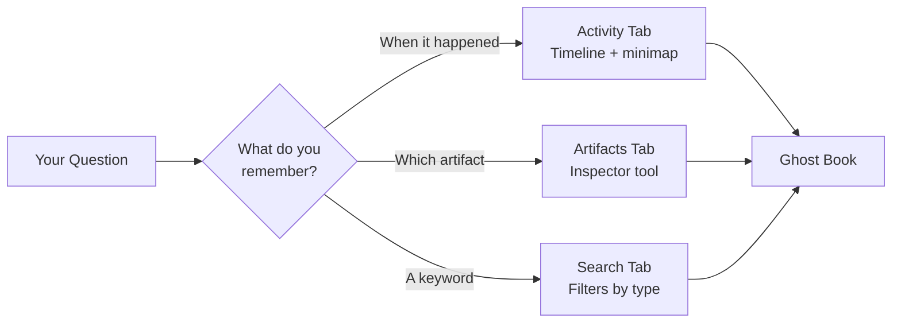
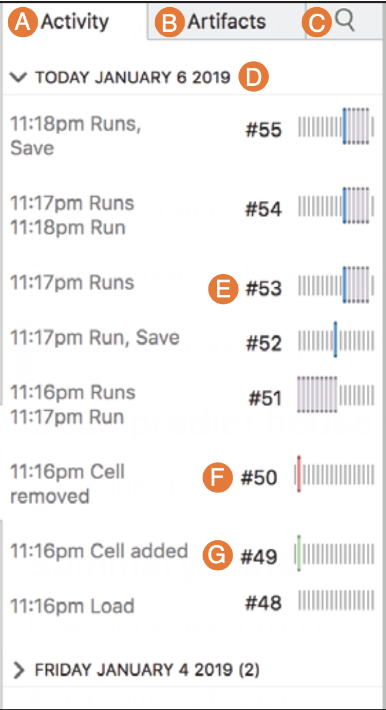
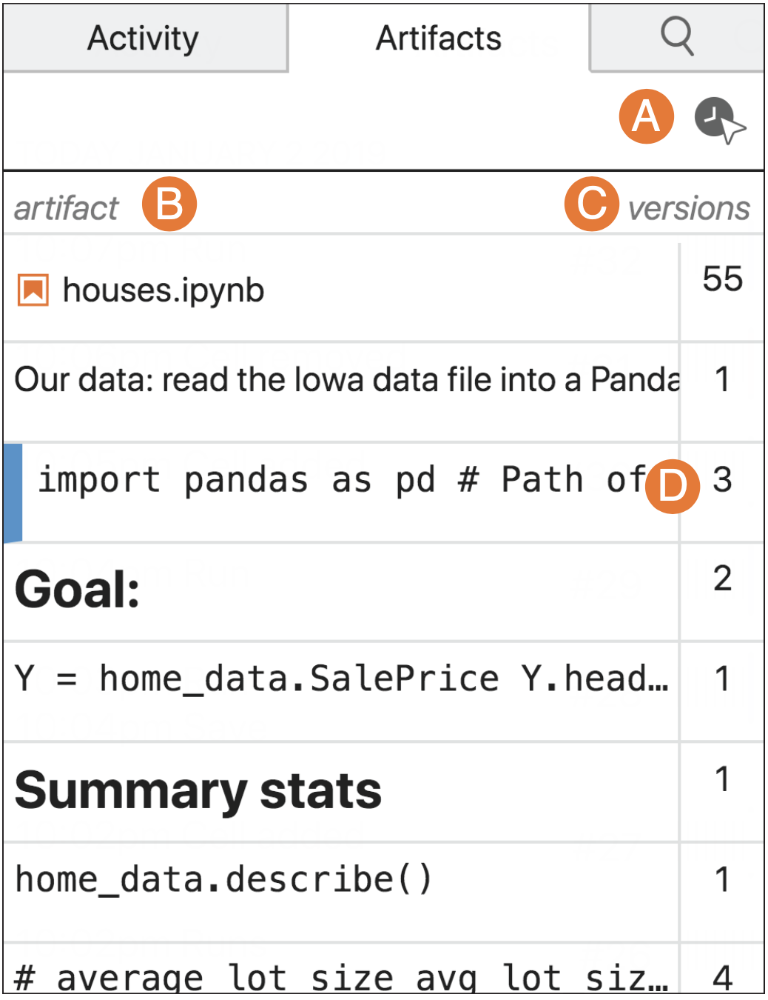
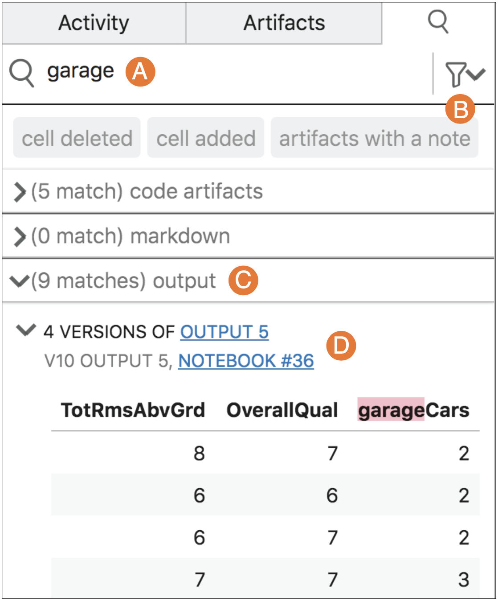
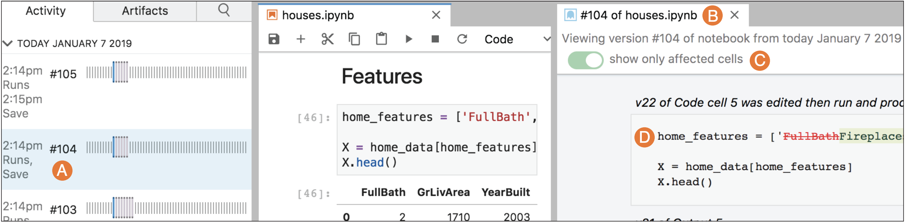

# Why Can't Data Scientists Remember What They Tried?

*Hunting for answers in 300 versions of a Jupyter notebook*

---

Imagine you've spent the afternoon building a machine learning model to predict house prices. You've tried dozens of features, tweaked hyperparameters, and finally landed on something that works. Then your manager asks the simple question "Why did you discard the garage size feature?"

You know you tested it and you remember the results weren't great. But where? When? The evidence is buried somewhere in your history of experiments, and finding it feels impossible.

This scenario happens all the time in data science. In one study, a researcher working on a beginner machine learning tutorial generated **302 versions** of their code in just one hour (Kery et al., 2019). That's five versions per minute, which pushes traditional version control to its limits.

## Exploratory Programming is Messy

Data science is less straight forward than building a web app for example. It's exploratory, iterative, and full of dead ends. You try something, check the output, tweak a parameter, try again. Traditional version control tools like Git were designed for software engineers who make deliberate commits with meaningful messages. Not for data scientists who are experimenting.

Studies show that **only 3 out of 10 data scientists use Git** (Kery et al., 2017). Instead they copy scripts or comment out alternatives. One participant said "It's just a lot of stuff and stuff and stuff" (Kery et al., 2018).

Here is what using Git with notebooks usually looks like:

```diff
diff --git a/analysis.ipynb b/analysis.ipynb
index 8f3d4e2..9a2b5f3 100644
@@ -15,7 +15,7 @@
 | metadata: {},
 | outputs: [],
 | source: [
-    x = 5\n,
+    x = 10\n,
 |  y = x * 2\n,
 |  print(y)
@@ -45,12 +45,12 @@
 | name: stdout,
 | output_type: stream,
 | text: [
-    "10\n"
+    "20\n"
@@ -89,7 +89,7 @@
 | nbconvert_exporter: python,
 | pygments_lexer: ipython3,
-  version: "3.8.5"
+  version: "3.8.8"
 |widgets: {
 | application/vnd.jupyter.widget-state+json: {
-    version_major: 2,
-    version_minor: 0
+    version_major: 3,
+    version_minor: 1
```

Good luck finding what actually changed in your analysis.

## Hunting for Information

To solve this problem, researchers explored **Information Foraging Theory (IFT)**. Developed by Pirolli and Card (1999) it applies principles from how animals hunt for food to how humans search for information.

Programmers are "predators" hunting for "prey" (the information they need) across "patches" (parts of the interface). Just as animals follow scent trails to food, programmers follow cues like dates, previews, and diff highlighting to find what they're looking for.

If foraging becomes too costly (too much scrolling, too many clicks, too little payoff) people give up. They will either redo the experiment or simply guess the outcome. Neither is acceptable.

## Verdant: A New Approach to Notebook History

Armed with these insights, researchers at Carnegie Mellon developed **Verdant**, a JupyterLab extension that rethinks how data scientists interact with their history (Kery et al., 2019).

At its core is **lilGit**, which is a versioning model that breaks notebooks into a hierarchy of artifacts:



Unlike Git, which tracks files, lilGit tracks artifacts. Individual code snippets, their outputs and AST-level changes. Each artifact maintains its own history, so you can ask "what were all the values this parameter ever had?" without wading through hundreds of commits.

Verdant captures checkpoints automatically whenever you run, save, add, or delete a cell. No manual commits required. The history is stored in a simple `.ipyhistory` file.

However the real innovation is in how Verdant helps you find things. It offers 3 foraging strategies:



### The 3 Foraging Strategies

The **Activity tab** shows history by time. Each version displays a minimap showing where in the notebook changes occured, leveraging spatial memory. The minimap uses different colors. Blue for edits, green for additions, red for deletions, and grey for cells that were run without changes.



*Figure 2: The Activity tab with timeline and minimap visualization. Each vertical line in the minimap represents a cell; colored lines indicate activity.*

The **Artifacts tab** works like a browser's HTML inspector: click any cell, snippet, or output to see its complete version history accross the entire project. The table of contents view shows each artifact with its version count, which makes it easy to find sections that have been edited a lot.



*Figure 3: The Artifacts tab showing a table of contents. The number on the right indicates how many versions each artifact has.*

The **Search tab** handles keyword queries with filters for artifact types and dates. This is a good way to for example "find all tables that included a column named Garage." Results are grouped by artifact type, code, markdown, output, to reduce scrolling.



*Figure 4: Searching for "garage" returns categorized results.*

In order to get the full context Verdant opens a **Ghost Book**. This is a read-only view of any past notebook version displayed side-by-side with your current work. Diff highlighting shows what changed in green (additions) and red (deletions).



*Figure 5: A ghost book displays a past notebook version with diff highlighting. The toggle lets users show only cells that changed in that version.*

## Does It Actually Work?

The researchers tested Verdant with 15 data scientists at JupyterCon 2018. All participants were complete novices to the tool and were asked to answer questions about a 300-version notebook they had never seen before.

They scored **80% median success rate** across realistic foraging tasks (Kery et al., 2019). First-time users could successfully navigate someone else's complex history to find specific code, outputs, and relationships.

The failures were also instructive. Users struggled most with questions requiring them to relate multiple artifacts across time. This led to redesigns that grouped related results and added better navigation cues.

## Where Do We Go From Here?

Verdant was just the beginning. Recent work like **Kishuboard** (Fang et al., 2025) extends these ideas to track not just code history but also data state, letting users branch their exploration without losing progress or reloading datasets.

In the future notebooks could automaticaly generate narratives explaining why changes happened, not just what changed. Also, AI could help synthesize patterns from hundreds of experiments into useful insights.

With data science evolving faster than ever, the tools must also evolve beyond "save early, save often" toward genuine support for the exploratory, iterative work that data scientists actually do. The goal isn't just to remember what you tried, it's to understand why you made the choices you did.

---

## References

Fang, H., Chockchowwat, S., Sundaram, H., & Park, Y. (2025). Enhancing computational notebooks with code+data space versioning. *Proceedings of the 2025 CHI Conference on Human Factors in Computing Systems*. ACM.

Kery, M. B., Horvath, A., & Myers, B. A. (2017). Variolite: Supporting exploratory programming by data scientists. *Proceedings of the 2017 CHI Conference on Human Factors in Computing Systems*, 1265–1276. https://doi.org/10.1145/3025453.3025626

Kery, M. B., John, B. E., O'Flaherty, P., Horvath, A., & Myers, B. A. (2019). Towards effective foraging by data scientists to find past analysis choices. *Proceedings of the 2019 CHI Conference on Human Factors in Computing Systems*, 1–13. https://doi.org/10.1145/3290605.3300322

Kery, M. B., Radensky, M., Arya, M., John, B. E., & Myers, B. A. (2018). The story in the notebook: Exploratory data science using a literate programming tool. *Proceedings of the 2018 CHI Conference on Human Factors in Computing Systems*, 1–11. https://doi.org/10.1145/3173574.3173748

Pirolli, P., & Card, S. (1999). Information foraging. *Psychological Review, 106*(4), 643–675.

---

I am a Master's student in Computer Science. Aside from playing volleyball and chess, I like to build web apps for friends and familiy and explore simple and user driven UX.
